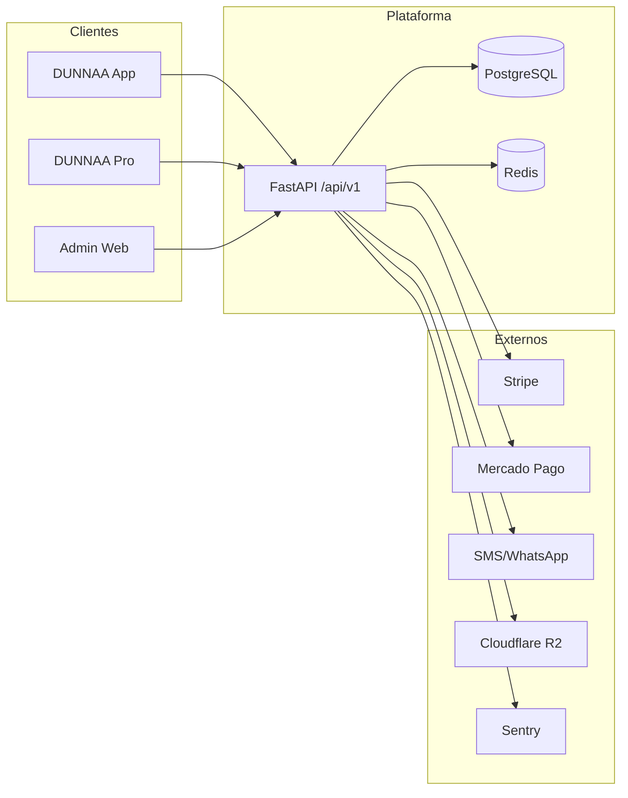

# DUNNAA — Blueprint do Projeto

> Documento-mestre: visão, produto, arquitetura, roadmap e estado atual.  
> Última atualização: Junho 2026

---

## 1. Visão e Propósito

**DUNNAA** é uma plataforma de agendamento, fila virtual, assinaturas e vendas para o **mercado de beleza e grooming** no Brasil — barbearias, salões, manicures, estética e lojas que vendem produtos de beleza.

### Segmentos-alvo

| Segmento | Exemplos | Foco na plataforma |
|----------|----------|-------------------|
| **Barbearias** | Corte, barba, degradê | Agendamento, fila, planos mensais de cortes |
| **Salões de beleza** | Cabelo, coloração, escova, tratamentos | Serviços por profissional, pacotes/combos |
| **Manicure & nail design** | Manicure, pedicure, alongamento | Slots por profissional, duração por serviço |
| **Estética & bem-estar** | Sobrancelha, depilação, maquiagem | Mesma engine de agenda + assinaturas |
| **Lojas de produtos** | Perfumaria, cosméticos, barbearia clássica com retail | Catálogo de produtos + venda avulsa ou no checkout do serviço |

> A plataforma trata todos como **estabelecimentos** com serviços, equipe, agenda e (opcionalmente) produtos. A diferença entre verticais é configurável por **categoria**, **tipo de serviço** e **catálogo** — não exige apps separados.

### Problema

- Estabelecimentos de beleza perdem clientes por filas longas e falta de visibilidade online
- Clientes não sabem quando há vaga ou quanto tempo esperar
- Planos mensais (ex.: “2 cortes/mês”, “1 manicure/semana”) são difíceis de operar sem sistema
- Donos não têm painel unificado para agenda, equipe, assinantes, **produtos** e financeiro

### Solução

Três produtos integrados a um backend único:

| Produto | Público | Função |
|---------|---------|--------|
| **DUNNAA** | Cliente final | Buscar, agendar, fila, assinar, check-in QR, pagar |
| **DUNNAA Pro** | Dono / profissional / staff | Gerir estabelecimento, agenda, planos, fila, produtos, financeiro |
| **Admin DUNNAA** | Equipe interna | Métricas, moderação, usuários, pagamentos, auditoria |

### Proposta de valor

1. **Cliente:** agendar em segundos, entrar na fila, assinar planos, comprar produtos no mesmo fluxo
2. **Estabelecimento:** menos no-show, receita recorrente (serviços + retail), gestão de equipe e comissões
3. **Plataforma:** receita via mensalidade SaaS + comissão por transação (serviço e produto)

---

## 2. Marca e Presença Digital

| Item | Valor |
|------|-------|
| App cliente | **DUNNAA** |
| App profissional | **DUNNAA Pro** |
| Domínio | **dunnaa.com.br** |
| API produção | `https://api.dunnaa.com.br/api/v1` |
| Admin produção | `https://admin.dunnaa.com.br` |
| Packages npm | `@dunnaa/*` |
| Infra técnica (DB, Redis) | `dunnaa`, `dunnaa_dev` (minúsculas) |

---

## 3. Modelo de Negócio

### Receita da plataforma

| Fonte | Detalhe |
|-------|---------|
| **Mensalidade SaaS** | R$ 29/mês (pequeno) · R$ 49/mês (médio/grande) |
| **Comissão avulso** | 8% sobre pagamento de agendamento avulso |
| **Comissão assinatura** | 6% sobre uso de créditos de plano |
| **Plugins (futuro)** | Ads/Boost, Marketing, Analytics Pro |

### Fluxo financeiro (simplificado)

```
Cliente paga → Stripe / Mercado Pago
    → Split: estabelecimento recebe líquido
    → Plataforma retém comissão (8% ou 6%)
    → Payout agendado ao estabelecimento
```

Gorjetas: 100% ao profissional, sem taxa da plataforma (MVP 1.1).

---

## 3.5 Categorias de estabelecimento

### Hoje no backend (`EstablishmentCategory`)

| Categoria | Valor API | Descrição |
|-----------|-----------|-----------|
| Barbearia | `barbershop` | Foco tradicional em cortes e barba |
| Salão | `salon` | Salão de beleza feminino/misto |
| Barbearia + salão | `barber_salon` | Estabelecimento híbrido |

### Roadmap de categorias (expandir enum + filtros)

| Categoria planejada | Valor sugerido | Prioridade |
|--------------------|----------------|------------|
| Manicure / nail bar | `nail_salon` | MVP 1.1 |
| Estética | `aesthetics` | MVP 1.1 |
| Loja de produtos (sem serviço) | `beauty_store` | MVP 1.1 |
| Loja + serviços (híbrido retail) | `beauty_retail` | MVP 1.1 |

Filtros de busca no app cliente: por **categoria**, **tipo de serviço** (corte, manicure, coloração…) e **vende produtos** (sim/não).

### Produtos de beleza (retail)

O backend já possui modelo **`Product`** vinculado ao estabelecimento e **`AppointmentProduct`** para incluir produtos no checkout do agendamento.

| Capacidade | Status | Notas |
|------------|--------|-------|
| CRUD produtos (owner) | ✅ API | Nome, preço, estoque, imagem |
| Produtos no agendamento | ✅ API | Add-on no momento do serviço |
| Catálogo público no app cliente | ⏳ | Listagem + carrinho simples |
| Loja standalone (só produtos, sem slot) | ⏳ | Pedido avulso / retirada |
| Comissão sobre venda de produto | ⏳ | Mesma regra 8% avulso (definir) |

---

## 4. Personas e Jornadas

### Cliente (Maria)

1. Baixa DUNNAA → login SMS
2. Busca salão, barbearia ou loja por nome, categoria ou localização
3. Vê serviços, profissionais, produtos e horários livres
4. Agenda serviço ou entra na **fila virtual**
5. Opcional: adiciona produtos (shampoo, esmalte, pomada) ao pedido
6. No dia: check-in via **QR code**
7. Avalia atendimento; opcional gorjeta (1.1)

### Dono / Profissional (João — DUNNAA Pro)

1. Cadastra estabelecimento (categoria: barbearia, salão, manicure, loja…)
2. Cria **serviços** (corte, manicure, escova…), **pacotes** e planos de assinatura
3. Cadastra **produtos** para venda (opcional)
4. Adiciona funcionários e define comissões
5. Gerencia agenda do dia e **modo fila**
6. Gera QR de check-in; acompanha assinantes e receita

### Admin interno

1. Login SMS com `role: admin`
2. Dashboard: estabelecimentos, usuários, receita, crescimento
3. Modera status de estabelecimentos e roles de usuários
4. Consulta pagamentos, assinaturas e **audit logs**

---

## 5. Escopo Funcional por MVP

Detalhamento completo em [`FEATURES.md`](./FEATURES.md). Resumo:

| Versão | Escopo |
|--------|--------|
| **MVP 1.0** | Auth SMS, busca, agendamento, fila, assinaturas, check-in QR, favoritos, portfólio, avaliações, pagamentos avulsos, produtos no agendamento |
| **MVP 1.1** | Gorjetas, avaliação→Google, no-show, notificações, referral, promoções, **categorias manicure/loja**, catálogo retail no app |
| **MVP 2.0** | Sistema de plugins (Ads, Marketing, Analytics Pro) |

### Features críticas MVP 1.0 (backend)

| Área | IDs | Status backend |
|------|-----|----------------|
| Auth SMS + JWT | C01–C02 | ✅ |
| Estabelecimentos / serviços / staff | B01–B33 | ✅ |
| Agendamentos | C34–C35 | ✅ parcial |
| Disponibilidade / slots | C33 | ✅ |
| Fila virtual | C40–C43 | ✅ |
| Planos (owner) | B50–B55 | ✅ |
| Assinatura cliente | C51–C53 | ✅ |
| Check-in QR + créditos | C60–C61 | ✅ |
| Pagamentos | C90–C91 | ✅ |
| Admin APIs | A01–A14 | ✅ |
| Busca + histórico | C10–C12 | ✅ |

---

## 6. Arquitetura Técnica

### Monorepo

```
dunnaa/
├── apps/
│   ├── admin/              # Next.js 15 — painel interno ✅
│   ├── cliente/            # Expo — app cliente 🔄 scaffold
│   └── barbeiro/           # Expo — DUNNAA Pro 🔄 scaffold
├── packages/
│   ├── api/                # FastAPI — backend principal ✅
│   └── shared/             # Tipos TypeScript compartilhados ✅
├── docs/                   # Documentação (este blueprint + API, DB, etc.)
├── .cursor/                # Rules, agents, skills para desenvolvimento com IA
├── docker-compose.yml      # Postgres 16 + Redis (dev)
├── turbo.json              # Turborepo
└── pnpm-workspace.yaml
```

### Stack

| Camada | Tecnologia |
|--------|------------|
| Mobile | React Native + Expo |
| Admin web | Next.js 15, Tailwind, App Router |
| API | FastAPI, SQLAlchemy 2 async, Pydantic v2 |
| Banco | PostgreSQL 16 |
| Cache / OTP / filas | Redis |
| Pagamentos | Stripe (+ Mercado Pago via factory) |
| SMS | Twilio / WhatsApp (configurável) |
| Storage | Cloudflare R2 (avatars, portfólio) |
| Observabilidade | Sentry, métricas `/metrics`, audit logs |
| CI | GitHub Actions (pytest, ruff, cobertura ≥50%) |
| Deploy alvo | Railway (API) · Vercel (admin) · EAS (mobile) |

### Padrão backend

```
Routes (app/api/v1/*.py)
  → Services (app/services/*.py)
  → Models (app/models/*.py)
  → Schemas (app/schemas/*.py)
```

- Auth/deps canônicos: `app/api/deps.py`, `app/core/config.py`
- RBAC por estabelecimento: owner, admin ou staff ativo
- Exceções de domínio: `AppException` e subclasses

### Evolução de escala

Ver [`ARCHITECTURE.md`](./ARCHITECTURE.md):

1. **Fase 1 (atual):** monolito modular FastAPI — até ~100k usuários
2. **Fase 2:** microsserviços Go para booking/fila + read replicas
3. **Fase 3:** event-driven (Kafka), multi-region

---

## 7. Domínios e Integrações



### Roles

| Role | Escopo |
|------|--------|
| `customer` | App cliente |
| `owner` | Dono do estabelecimento |
| `staff` | Funcionário vinculado |
| `admin` | Equipe DUNNAA (painel admin) |

---

## 8. Painel Admin (implementado)

| Rota | Função |
|------|--------|
| `/login` | Auth SMS (somente admin) |
| `/dashboard` | KPIs da plataforma |
| `/establishments` | Listagem + filtro status |
| `/establishments/[id]` | Detalhe + alterar status |
| `/users` | Listagem + busca/role |
| `/users/[id]` | Detalhe + alterar role |
| `/subscriptions` | Assinaturas |
| `/payments` | Pagamentos |
| `/audit-logs` | Auditoria |
| `/settings` | Configurações do sistema |

API base: `NEXT_PUBLIC_API_URL` → `/api/v1/admin/*`

---

## 9. Roadmap de Implementação

Plano detalhado em [`IMPLEMENTATION_PLAN.md`](./IMPLEMENTATION_PLAN.md). Fases executadas e pendentes:

| Fase | Conteúdo | Status |
|------|----------|--------|
| **0 — Fundação backend** | Sentry, health/metrics, OTP Redis, audit logs, deps unificadas, CI | ✅ |
| **1 — APIs Admin** | `/admin/*` dashboard, CRUD, pagamentos, audit | ✅ |
| **2 — Admin web + shared** | Next.js 15, tipos TS, todas as páginas admin | ✅ |
| **3 — Gaps MVP 1.0 backend** | Assinaturas cliente, slots, check-in créditos, busca | ✅ |
| **4 — Testes / CI hardened** | Cobertura 70%+, E2E críticos | ⏳ |
| **5 — Apps mobile** | Expo cliente (MVP telas) + barbeiro (scaffold) | 🔄 |
| **6 — MVP 1.1** | Gorjetas, Google reviews, referral, promoções | ⏳ |
| **7 — MVP 2.0** | Plugins (Ads, Marketing, Analytics) | 🔮 |

### Critérios de aceite MVP 1.0

**Funcional**

- [ ] Cliente busca, agenda e paga avulso
- [ ] Cliente assina plano e faz check-in QR
- [ ] Barbeiro gerencia serviços, equipe, planos e agenda
- [x] Admin vê métricas e modera plataforma

**Técnico**

- [ ] API p95 < 500ms
- [ ] Cobertura testes > 70% (mínimo CI: 50%)
- [x] Logs, Sentry e métricas básicas
- [x] Audit trail em ações admin sensíveis

---

## 10. Ambiente de Desenvolvimento

```bash
# Infra
docker-compose up -d

# Backend
cd packages/api && alembic upgrade head
pnpm dev:api                    # :8000

# Admin
cp apps/admin/.env.example apps/admin/.env.local
pnpm dev:admin                  # :3000

# Testes API
cd packages/api && pytest tests/ -v
```

### Variáveis principais

| Variável | Uso |
|----------|-----|
| `DATABASE_URL` | PostgreSQL async |
| `REDIS_URL` | OTP, cache, rate limit |
| `JWT_SECRET` | Tokens access/refresh |
| `STRIPE_*` | Pagamentos |
| `NEXT_PUBLIC_API_URL` | Admin → API |

---

## 11. Documentação Relacionada

| Documento | Conteúdo |
|-----------|----------|
| [`BLUEPRINT.md`](./BLUEPRINT.md) | Este documento — visão geral |
| [`FEATURES.md`](./FEATURES.md) | Matriz completa de features |
| [`ARCHITECTURE.md`](./ARCHITECTURE.md) | Decisões de arquitetura e escala |
| [`API.md`](./API.md) | Referência de endpoints |
| [`DATABASE.md`](./DATABASE.md) | Schema PostgreSQL |
| [`IMPLEMENTATION_PLAN.md`](./IMPLEMENTATION_PLAN.md) | Cronograma por fase |
| [`BACKEND_REVIEW.md`](./BACKEND_REVIEW.md) | Dívida técnica e revisões |
| [`AGENTS.md`](../AGENTS.md) | Instruções para agentes AI |

---

## 12. Princípios de Produto e Engenharia

1. **Mobile-first** — cliente e barbeiro vivem no celular
2. **Backend sólido primeiro** — admin e mobile consomem a mesma API
3. **Monorepo** — tipos compartilhados (`@dunnaa/shared`), um deploy por app
4. **Segurança** — RBAC, audit logs, OTP em Redis, sem secrets no git
5. **Evolução incremental** — monolito modular hoje; extrair serviços quando escala exigir
6. **Português BR** — UX, mensagens de API e documentação para o mercado local

---

## 13. Origem do Projeto

Codebase derivado do repositório [Navaro](https://github.com/viniciussvasques/navaro), rebrandado e estendido para **DUNNAA** / **dunnaa.com.br**, com foco em painel admin, observabilidade e APIs administrativas como prioridade de entrega.

---

*DUNNAA — agendamento, beleza e produtos para quem cuida do visual e para quem cuida do cliente.*
